# Customer Churn Analysis & Prediction
> End-to-end customer churn analysis and machine learning project using Python, Pandas, Scikit-learn, and business-focused insights.

### ⭐ Project Highlights

- 📊 Analyzed **7K+ customer records**
- 🔍 Identified key customer churn patterns and high-risk segments
- 🤖 Built **Logistic Regression** and **Random Forest** models
- 📈 Achieved **83.57% ROC-AUC** with Logistic Regression
- 🎯 Random Forest achieved **77.01% Recall** for churn detection
- 💼 Generated actionable **customer retention recommendations**


## 📌 Project Overview

Customer churn is a major business problem for subscription-based companies. This project analyzes customer behavior, identifies key churn patterns, and builds machine learning models to predict customers who are likely to churn.

The project combines data cleaning, exploratory data analysis, feature engineering, machine learning, model evaluation, and business recommendations.

---

## 🎯 Business Objective

The main objectives of this project are:

- Analyze customer churn patterns
- Identify high-risk customer segments
- Understand factors associated with customer churn
- Build machine learning models to predict churn
- Compare different classification models
- Provide actionable customer retention recommendations

---

## 📂 Dataset

**Dataset:** IBM Telco Customer Churn Dataset

- Original customers: 7,043
- Cleaned customers: 7,032
- Original columns: 21
- Removed records: 11 invalid/blank `TotalCharges` values
- Target variable: `Churn`

### Target Variable

- `1` = Customer Churned
- `0` = Customer Did Not Churn

---

## 🛠️ Technologies Used

- Python
- Pandas
- NumPy
- Matplotlib
- Seaborn
- Scikit-learn
- Git
- GitHub

---

## 🔄 Project Workflow

1. Data Understanding
2. Data Cleaning
3. Exploratory Data Analysis
4. Feature Analysis
5. Feature Engineering
6. Logistic Regression Model
7. Model Evaluation
8. Random Forest Model
9. Feature Importance Analysis
10. Model Comparison
11. Business Insights & Recommendations

---

# 📊 Exploratory Data Analysis

## Overall Churn Distribution


## Churn by Contract Type

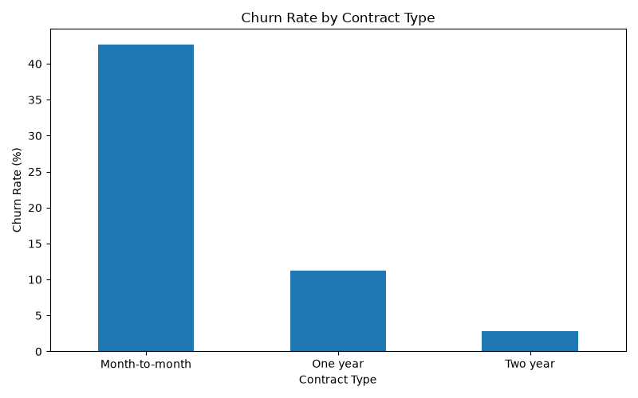

## Churn by Internet Service

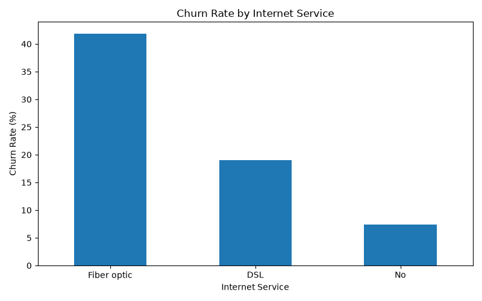

## Churn by Payment Method

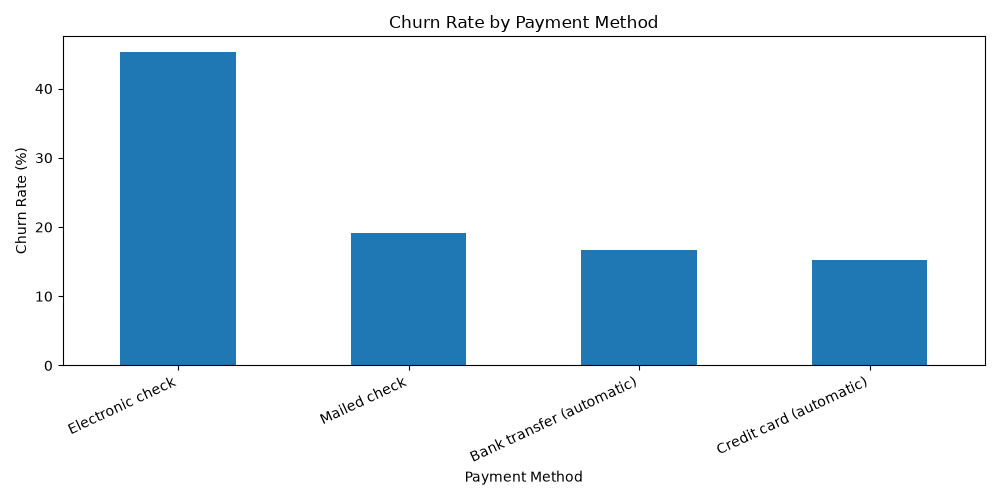

---

# 🔎 Feature Analysis

## Churn by Tenure Group

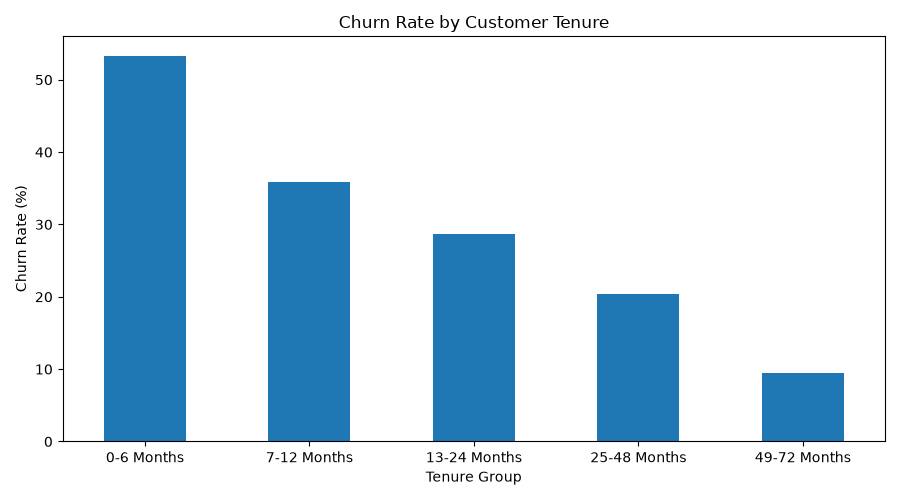

## Churn by Monthly Charges

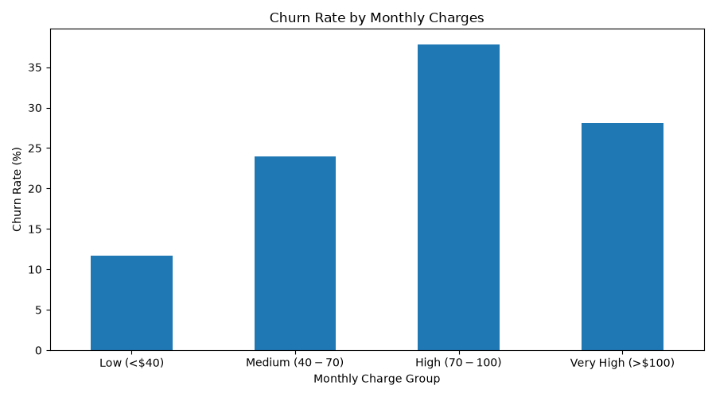

## Churn by Tech Support


## Churn by Online Security

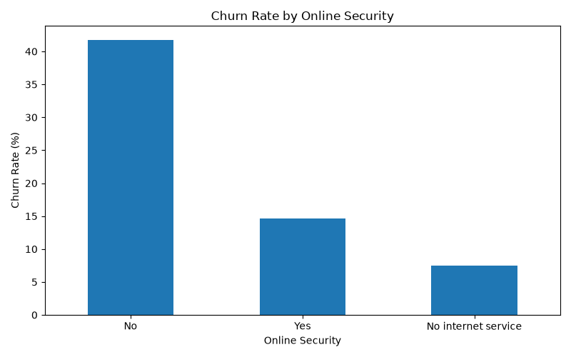

## Churn by Senior Citizen Status

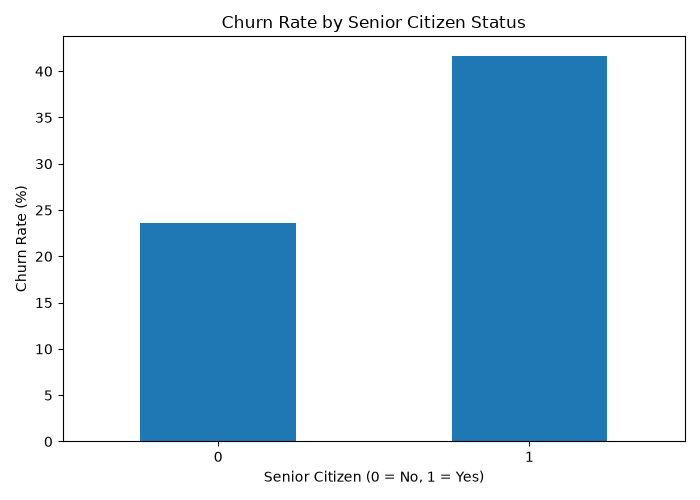

---

# 📊 Power BI Dashboard

An interactive Power BI dashboard was developed to monitor customer churn patterns, identify high-risk customer segments, and support data-driven retention strategies.

### Dashboard Features

- Total Customers
- Churned Customers
- Churn Rate
- Average Monthly Charges
- High-Risk Customers
- Churn Rate by Contract Type
- Churn Rate by Internet Service
- Churn Rate by Payment Method
- Churn Rate by Tenure
- Churn Rate by Monthly Charges
- Churn Rate by Tech Support
- Churn Rate by Online Security
- Churn Rate by Senior Citizen
- Interactive slicers for Contract, Internet Service, and Payment Method

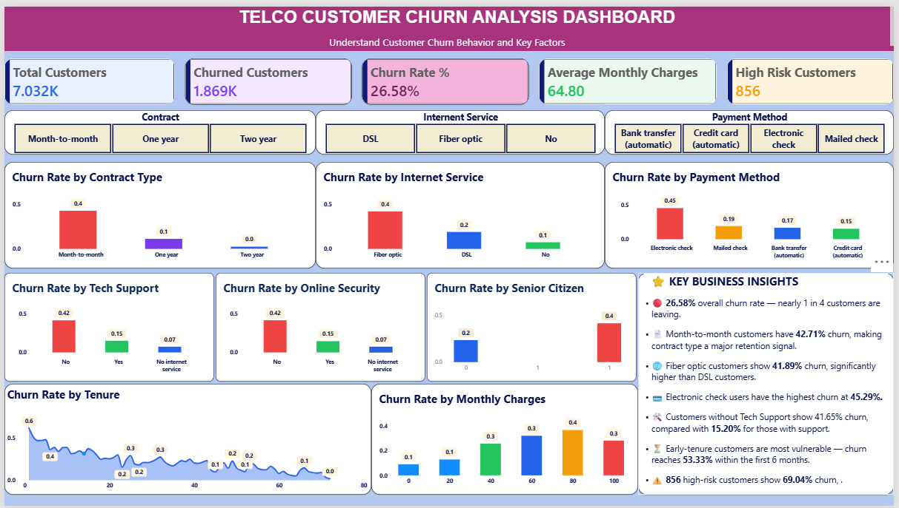

---

# 📈 Key Business Insights

### 1. Overall Churn Rate

The overall customer churn rate was **26.58%**.

This indicates that approximately one in four customers left the service.

**Recommendation:** Develop targeted customer retention and engagement strategies.

---

### 2. Month-to-Month Customers

Month-to-month customers had a **42.71% churn rate**, considerably higher than customers on longer-term contracts.

**Recommendation:** Encourage customers to move to one-year or two-year contracts through loyalty benefits and suitable offers.

---

### 3. New Customers Are High Risk

Customers with **0–6 months of tenure** had a **53.33% churn rate**.

**Recommendation:** Strengthen onboarding, early engagement, and first-year retention programs.

---

### 4. Higher Monthly Charges

Customers paying **$70–$100 per month** had a **37.85% churn rate**.

**Recommendation:** Review pricing, bundles, and value-added services for higher-paying customers.

---

### 5. Electronic Check Payments

Customers using **Electronic Check** had a **45.29% churn rate**.

**Recommendation:** Encourage automatic payment methods through convenient payment options and customer education.

---

### 6. Technical Support

Customers without Tech Support had a **41.65% churn rate**, compared with **15.20%** among customers with Tech Support.

**Recommendation:** Promote technical support services and proactive issue resolution.

---

### 7. Online Security

Customers without Online Security had a **41.78% churn rate**, compared with **14.64%** among customers with Online Security.

**Recommendation:** Promote security services as part of customer packages.

---

# 🚨 High-Risk Customer Segment

A high-risk segment was identified using the following conditions:

- Month-to-month contract
- Monthly charges greater than $70
- Tenure of 12 months or less

### Segment Results

- Customers: **856**
- Churn rate: **69.04%**

This segment represents a strong priority for targeted retention campaigns.

> Note: These findings describe associations in the dataset and should not be interpreted as proof of causation.

---

# 🤖 Machine Learning

Two classification models were developed and compared:

- Logistic Regression
- Random Forest

The dataset was divided using an **80/20 stratified train-test split**.

---

## 📊 Model Performance

| Model | Accuracy | Precision | Recall | F1-Score | ROC-AUC |
|---|---:|---:|---:|---:|---:|
| Logistic Regression | 80.38% | 64.76% | 57.49% | 60.91% | 83.57% |
| Random Forest | 74.77% | 51.71% | 77.01% | 61.87% | 83.46% |

---

## 🏆 Model Selection

**Random Forest** was selected as the business-focused model because it achieved:

- Higher Recall: **77.01%**
- Slightly higher F1-Score: **61.87%**
- ROC-AUC: **83.46%**

Higher recall is useful for churn detection because the business may prefer to identify more customers who are actually at risk of leaving.

However, Random Forest has lower precision and accuracy than Logistic Regression, so the final model choice should depend on the company's retention campaign cost and tolerance for false positives.

---

## 📉 Confusion Matrix

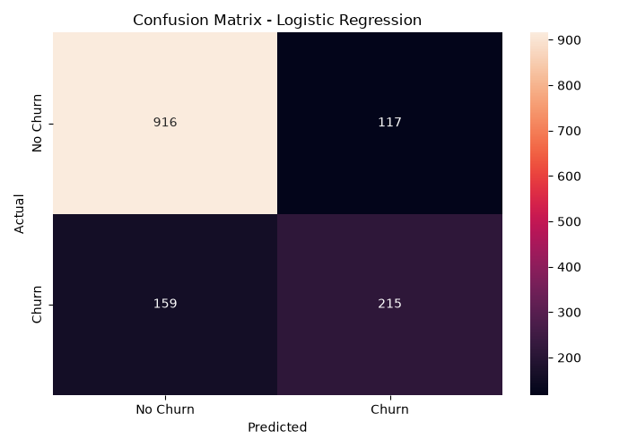

## 📈 ROC Curve

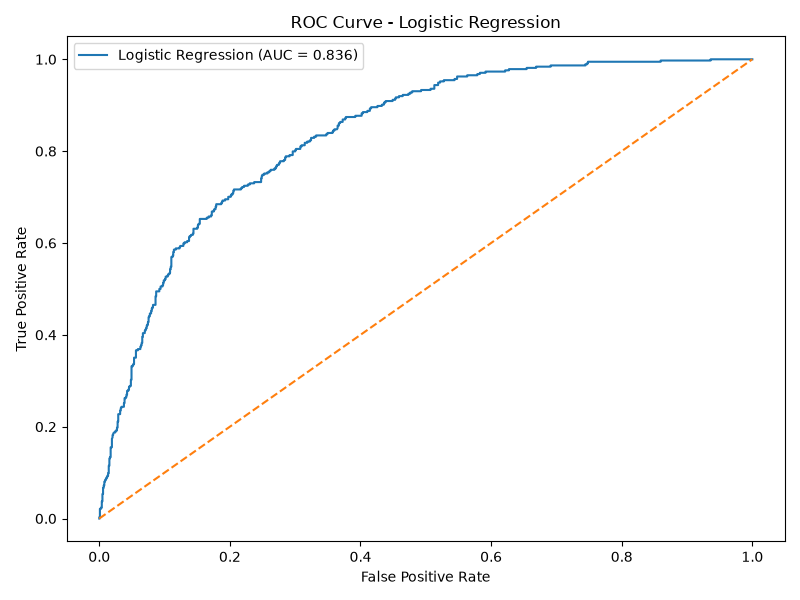

---

# 🔬 Feature Importance

The Random Forest model identified the following important predictive features:

1. Tenure
2. Total Charges
3. Monthly Charges
4. Two-Year Contract
5. Fiber Optic Internet Service
6. Electronic Check Payment
7. One-Year Contract
8. Online Security
9. Tech Support
10. Paperless Billing

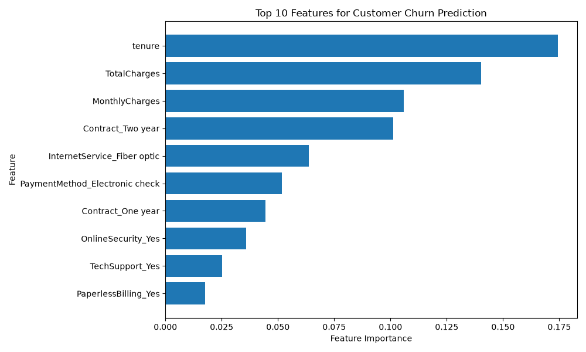

> Feature importance indicates predictive contribution within the model and should not be interpreted as causal impact.

---

# ⚖️ Model Comparison

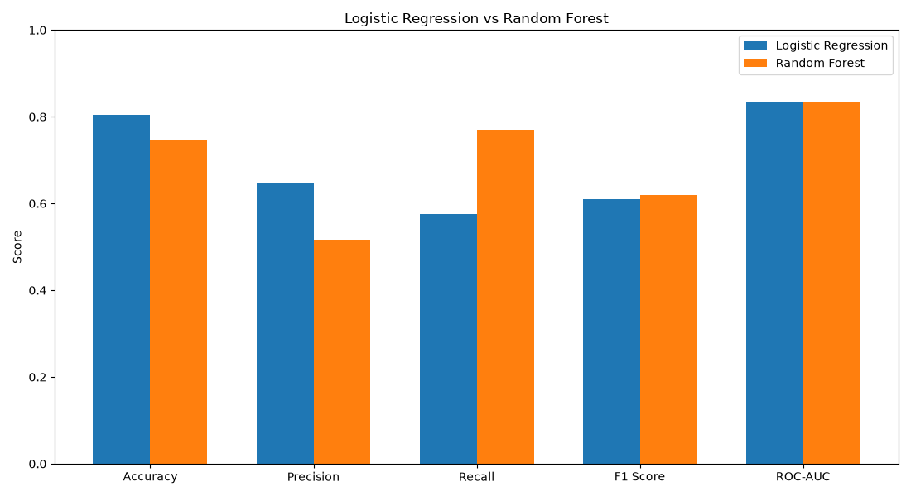

---

# 💼 Business Recommendations

Based on the analysis, the company can focus on:

- Improving onboarding for new customers
- Converting month-to-month customers to longer-term contracts
- Creating targeted offers for high-paying customers
- Promoting automatic payment methods
- Increasing awareness of Tech Support services
- Promoting Online Security packages
- Prioritizing high-risk customers for proactive retention campaigns

---

# 📁 Project Structure

```text
Customer_Churn_Analysis/
│
├── data/
│   ├── raw/
│   │   └── Telco-Customer-Churn.csv
│   │
│   ├── cleaned/
│   │   └── Telco-Customer-Churn-Cleaned.csv
│   │
│   └── processed/
│       ├── Telco-Customer-Churn-Engineered.csv
│       ├── churn_predictions.csv
│       └── random_forest_predictions.csv
│
├── outputs/
│   ├── churn_distribution.png
│   ├── churn_by_contract.png
│   ├── churn_by_internet_service.png
│   ├── churn_by_payment_method.png
│   ├── churn_by_tenure_group.png
│   ├── churn_by_monthly_charges.png
│   ├── churn_by_tech_support.png
│   ├── churn_by_online_security.png
│   ├── churn_by_senior_status.png
│   ├── tenure_vs_churn.png
│   ├── monthly_charges_vs_churn.png
│   ├── confusion_matrix_logistic_regression.png
│   ├── roc_curve_logistic_regression.png
│   ├── top_10_feature_importance.png
│   └── model_comparison.png
│
├── src/
│   ├── 01_data_understanding.py
│   ├── 02_data_cleaning.py
│   ├── 03_eda.py
│   ├── 04_feature_analysis.py
│   ├── 05_feature_engineering.py
│   ├── 06_model_training.py
│   ├── 07_model_evaluation.py
│   ├── 08_random_forest.py
│   ├── 09_feature_importance.py
│   ├── 10_model_comparison.py
│   └── 11_business_insights.py
│
├── .gitignore
├── README.md
└── requirements.txt
```

---

# 🎯 Key Project Outcomes

- Analyzed **7K+ customer records**
- Performed data cleaning and preprocessing
- Conducted exploratory data analysis
- Identified major churn patterns
- Created engineered machine learning features
- Built Logistic Regression and Random Forest models
- Evaluated models using Accuracy, Precision, Recall, F1-Score, and ROC-AUC
- Identified high-risk customer segments
- Generated actionable customer retention recommendations

---

# 💡 Business Impact

This analysis can help a subscription-based business:

- Identify customers at higher risk of churn
- Prioritize retention campaigns
- Improve customer onboarding
- Increase adoption of support and security services
- Encourage longer-term contracts
- Make data-driven customer retention decisions

---

# 👩‍💻 Author

**Priyadarshani Biswal**

Aspiring Data Analyst

**Skills:** Python | SQL | Excel | Power BI | Data Analysis | Machine Learning 